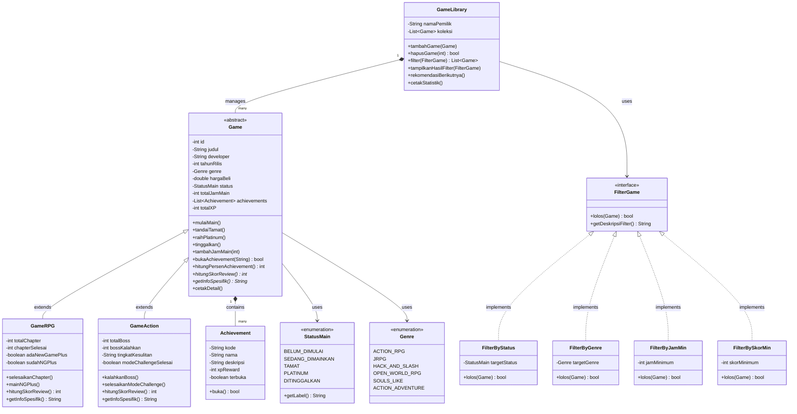

# Sistem Game Library Pribadi

**Mata Kuliah:** Struktur Data dan Pemrograman Berorientasi Objek
**Studi Kasus:** Memilih & Mengelola Koleksi Game Pribadi
**Bahasa:** Java 17+

---

## Deskripsi Kasus

Sebagai seorang gamer, mengelola koleksi game yang terus bertambah bisa menjadi tantangan tersendiri. Sering kali kita lupa game mana yang sudah tamat, mana yang masih setengah jalan, atau mana yang sudah lama ditinggalkan. Sistem ini mensimulasikan **game library digital pribadi** seperti yang ada di Steam atau PSN, namun difokuskan pada pengelolaan kemajuan bermain secara personal.

Fitur utama:
1. Menyimpan koleksi game RPG dan Action dengan data lengkap
2. Melacak **status kemajuan** bermain: Belum Dimulai -> Sedang Dimainkan -> Tamat -> Platinum
3. Mencatat **playtime log** (jam bermain kumulatif)
4. Melacak **achievement tracker** per game dengan sistem XP reward
5. Menghitung **skor review personal** yang berbeda formula-nya antara RPG dan Action
6. Memfilter koleksi berdasarkan berbagai kriteria (status, genre, jam, skor)
7. Merekomendasikan game berikutnya yang sebaiknya dimainkan

---

## Struktur File

```
game-library-oop/
├── src/
│   ├── Genre.java          # Enum genre game (RPG/Action)
│   ├── StatusMain.java     # Enum alur status bermain
│   ├── Achievement.java    # Entitas achievement/trophy
│   ├── Game.java           # Abstract class -- base semua game
│   ├── GameRPG.java        # Subclass game RPG (chapter + NG+)
│   ├── GameAction.java     # Subclass game Action (boss + kesulitan)
│   ├── FilterGame.java     # Interface strategi filter
│   ├── Filter.java         # 4 implementasi FilterGame
│   ├── GameLibrary.java    # Manajemen koleksi + statistik
│   └── Main.java           # Entry point & simulasi skenario
└── README.md
```

---

## Class Diagram



---

## Kode Program Java

### `StatusMain.java` - State Machine Bermain

```java
public enum StatusMain {
    BELUM_DIMULAI("Belum Dimulai"),
    SEDANG_DIMAINKAN(">  Sedang Dimainkan"),
    TAMAT("[OK] Tamat"),
    PLATINUM("Platinum / 100%"),
    DITINGGALKAN("Ditinggalkan");

    private final String label;
    StatusMain(String label) { this.label = label; }
    public String getLabel() { return label; }
}
```

### `Achievement.java` - Tracker Achievement

```java
public class Achievement {
    private String kode, nama, deskripsi;
    private int xpReward;
    private boolean terbuka;

    public boolean buka() {
        if (terbuka) return false;
        terbuka = true;
        return true;
    }
}
```

### `Game.java` - Abstract Class

```java
public abstract class Game {
    // ... field private (Encapsulation)

    public void tandaiTamat() {
        if (status == StatusMain.SEDANG_DIMAINKAN) {
            status = StatusMain.TAMAT;
        }
    }

    public void raihPlatinum() {
        long terbuka = achievements.stream().filter(Achievement::isTerbuka).count();
        if (status == StatusMain.TAMAT && terbuka == achievements.size()) {
            status = StatusMain.PLATINUM;
        }
    }

    // Wajib diimplementasikan subclass -- Abstraction
    public abstract int hitungSkorReview();
    public abstract String getInfoSpesifik();
}
```

### `GameRPG.java` - Subclass RPG

```java
public class GameRPG extends Game {
    private int totalChapter, chapterSelesai;
    private boolean adaNewGamePlus, sudahNGPlus;

    /** Skor RPG: chapter(40) + achievement(30) + jam(20) + NG+(10) */
    @Override
    public int hitungSkorReview() {
        double skorChapter = (chapterSelesai * 40.0 / totalChapter);
        double skorAchiev  = hitungPersenAchievement() * 0.30;
        double skorJam     = Math.min(getTotalJamMain() / 60.0, 1.0) * 20;
        int    bonusNG     = sudahNGPlus ? 10 : 0;
        return (int) Math.min(skorChapter + skorAchiev + skorJam + bonusNG, 100);
    }
}
```

### `GameAction.java` - Subclass Action

```java
public class GameAction extends Game {
    private int totalBoss, bossKalahkan;
    private String tingkatKesulitan;
    private boolean modeChallengeSelesai;

    /** Skor Action: boss(40) x multiplier_kesulitan + achievement(30) + jam(20) + challenge(10) */
    @Override
    public int hitungSkorReview() {
        double mult       = getMultiplierKesulitan(); // Easy=0.75, Normal=1.0, Hard=1.2, Nightmare=1.4
        double skorBoss   = (bossKalahkan * 40.0 / totalBoss) * mult;
        double skorAchiev = hitungPersenAchievement() * 0.30;
        double skorJam    = Math.min(getTotalJamMain() / 30.0, 1.0) * 20;
        int    bonusChall = modeChallengeSelesai ? 10 : 0;
        return (int) Math.min(skorBoss + skorAchiev + skorJam + bonusChall, 100);
    }
}
```

### `FilterGame.java` - Interface

```java
public interface FilterGame {
    boolean lolos(Game game);
    String getDeskripsiFilter();
}
```

### `Filter.java` - Empat Implementasi

```java
class FilterByStatus  implements FilterGame { /* status == target */ }
class FilterByGenre   implements FilterGame { /* genre == target  */ }
class FilterByJamMin  implements FilterGame { /* jam >= minimum   */ }
class FilterBySkorMin implements FilterGame { /* skor >= minimum  */ }
```

### `GameLibrary.java` - Manajer Koleksi

```java
public class GameLibrary {
    public List<Game> filter(FilterGame kriteria) {
        return koleksi.stream()
            .filter(kriteria::lolos)
            .collect(Collectors.toList());
    }

    public void rekomendasiBerikutnya() {
        koleksi.stream()
            .filter(g -> g.getStatus() == StatusMain.BELUM_DIMULAI
                      || g.getStatus() == StatusMain.DITINGGALKAN)
            .sorted(Comparator.comparingDouble(Game::getHargaBeli).reversed())
            .limit(3)
            .forEach(/* tampilkan */);
    }
}
```

---

## Screenshot Output

```
+==================================================+
|        SISTEM GAME LIBRARY PRIBADI - OOP         |
+==================================================+

========== MENAMBAH GAME KE LIBRARY ==========
  [+] "Elden Ring" ditambahkan ke library Arul.
  [+] "Sekiro: Shadows Die Twice" ditambahkan ke library Arul.

========== SESI MAIN: ELDEN RING ==========
  [>] Mulai main "Elden Ring"
  [] +15 jam -> total 15 jam untuk "Elden Ring"
  [[UNLOCKED]] Achievement unlocked: "Dragonslayer" +200 XP (total XP: 200)
  [[BOOK]] Chapter 1/12 selesai di "Elden Ring"
  [[BOOK]] Chapter 2/12 selesai di "Elden Ring"
  [[BOOK]] Chapter 3/12 selesai di "Elden Ring"
  [] +25 jam -> total 40 jam untuk "Elden Ring"
  [[UNLOCKED]] Achievement unlocked: "Walking Mausoleum" +300 XP (total XP: 500)
  [[BOOK]] Chapter 4/12 selesai di "Elden Ring"
  [[BOOK]] Chapter 5/12 selesai di "Elden Ring"
  [[BOOK]] Chapter 6/12 selesai di "Elden Ring"
  [[BOOK]] Chapter 7/12 selesai di "Elden Ring"
  [[BOOK]] Chapter 8/12 selesai di "Elden Ring"
  [[BOOK]] Chapter 9/12 selesai di "Elden Ring"
  [[BOOK]] Chapter 10/12 selesai di "Elden Ring"
  [[BOOK]] Chapter 11/12 selesai di "Elden Ring"
  [[BOOK]] Chapter 12/12 selesai di "Elden Ring"
  [] Semua chapter selesai! Tandai tamat? Gunakan tandaiTamat().
  [] +20 jam -> total 60 jam untuk "Elden Ring"
  [[UNLOCKED]] Achievement unlocked: "Elden Lord" +500 XP (total XP: 1000)
  [[OK]] "Elden Ring" ditandai TAMAT setelah 60 jam.

  [TEST] Coba platinum padahal achievement belum semua terbuka...
  [] PLATINUM! "Elden Ring" - semua 3 achievement terbuka!

========== SESI MAIN: SEKIRO (DITINGGALKAN) ==========
  [>] Mulai main "Sekiro: Shadows Die Twice"
  [] +8 jam -> total 8 jam untuk "Sekiro: Shadows Die Twice"
  [[FIGHT]] Boss 1/8 dikalahkan di "Sekiro: Shadows Die Twice" [Hard]
  [[FIGHT]] Boss 2/8 dikalahkan di "Sekiro: Shadows Die Twice" [Hard]
  [] "Sekiro: Shadows Die Twice" ditinggalkan.

========== DETAIL GAME ==========

--------------------------------------------------------
   #101  Elden Ring  (2022)
  Developer   : FromSoftware
  Genre       : Open World RPG
  Status      :  Platinum / 100%
  Jam Main    : 60 jam
  Achievement : 3/3 (100%)
  Total XP    : 1000
  Skor Review : 90/100
  Info        : Chapter: 12/12
--------------------------------------------------------

   Semua game di library Arul (2 game):
  ----------------------------------------------------------------------------------------------------
  #   Judul                        | Genre              | Status                 |      Jam | Skor
  ----------------------------------------------------------------------------------------------------
  #101 Elden Ring                   | Open World RPG     |  Platinum / 100%       |  60 jam | Skor: 90
  #102 Sekiro: Shadows Die Twice    | Souls-like         |  Ditinggalkan          |   8 jam | Skor: 17
  ----------------------------------------------------------------------------------------------------

================================================
   LIBRARY MILIK ARUL
================================================
  Total game          : 2
   Belum dimulai    : 0
  >  Sedang dimainkan : 0
  [OK] Tamat            : 0
   Platinum         : 1
   Ditinggalkan     : 1
  -------------------------------------
  Total jam main      : 68 jam
  Total XP terkumpul  : 1000 XP
  Rata-rata skor      : 53.5/100
================================================
========== DEMO FILTER LIBRARY ==========

  [SEARCH] Filter: Status = [OK] Tamat - 0 game ditemukan
  (tidak ada hasil)

  [SEARCH] Filter: Genre = Souls-like - 1 game ditemukan
  #102 Sekiro: Shadows Die Twice    | Souls-like         |  Ditinggalkan          |   8 jam | Skor: 17

  [SEARCH] Filter: Jam main >= 30 jam - 1 game ditemukan
  #101 Elden Ring                   | Open World RPG     |  Platinum / 100%       |  60 jam | Skor: 90

  [SEARCH] Filter: Skor review >= 70 - 1 game ditemukan
  #101 Elden Ring                   | Open World RPG     |  Platinum / 100%       |  60 jam | Skor: 90

   Rekomendasi game berikutnya:
  -> "Sekiro: Shadows Die Twice" (Souls-like) -  Ditinggalkan

========== EDGE CASE ==========
  [TEST] Tambah jam ke game yang belum dimulai -> otomatis mulai...     

  [TEST] Coba NG+ tanpa tamat dulu...
  [!] Harus tamat dulu sebelum NG+.
```

---

## Penjelasan Prinsip-Prinsip OOP

### 1. Encapsulation

Semua atribut di kelas `Game`, `Achievement`, dan `GameLibrary` dideklarasikan `private`. Akses hanya melalui getter dan method resmi yang memvalidasi logika bisnis. Contoh: field `terbuka` di `Achievement` hanya bisa diubah melalui method `buka()` -- setelah terbuka, tidak bisa dikunci ulang.

```java
// Tidak bisa langsung: achievement.terbuka = true;
// Harus melalui:
boolean berhasil = achievement.buka(); // validasi di dalam method
```

### 2. Inheritance

`GameRPG` dan `GameAction` mewarisi semua fitur dari `Game` (abstract) tanpa menulis ulang logika dasar seperti manajemen achievement, playtime log, dan state machine status. Masing-masing subclass hanya menambahkan atribut uniknya: chapter & NG+ untuk RPG, boss & tingkat kesulitan untuk Action.

### 3. Polymorphism

Method `hitungSkorReview()` di-override dengan formula yang **berbeda secara signifikan** di tiap subclass:
- `GameRPG` menghitung berdasarkan progres **chapter** + bonus **New Game+**
- `GameAction` menghitung berdasarkan **boss** yang dikalahkan x **multiplier kesulitan** + bonus **mode challenge**

Efeknya: satu panggilan `game.hitungSkorReview()` di `GameLibrary` akan menghasilkan kalkulasi yang tepat untuk tiap jenis game, tanpa perlu `instanceof` check.

### 4. Abstraction

Dua level abstraksi:
- **Abstract Class** (`Game`): mendefinisikan kerangka umum game, memaksa setiap subclass mengimplementasikan `hitungSkorReview()` dan `getInfoSpesifik()`. Tidak ada yang bisa membuat objek `Game` secara langsung.
- **Interface** (`FilterGame`): mendefinisikan kontrak filter -- `GameLibrary` tidak perlu tahu implementasi detailnya, cukup panggil `kriteria.lolos(game)`. Menambah jenis filter baru (misal: `FilterByDeveloper`) tidak perlu mengubah kode `GameLibrary` sama sekali.

---

## Keunikan Program

### 1. State Machine Bermain via Enum
Status bermain dimodelkan sebagai *state machine* 5-tahap dengan alur yang dikontrol ketat: `BELUM_DIMULAI -> SEDANG_DIMAINKAN -> TAMAT -> PLATINUM`. Transisi hanya boleh terjadi jika prasyaratnya terpenuhi -- misalnya, `raihPlatinum()` akan gagal jika masih ada achievement yang terkunci.

### 2. Formula Skor Review Berbeda per Subclass
`GameRPG` dan `GameAction` punya rumus skor yang mencerminkan karakteristik game-nya. RPG dihargai dari chapter dan NG+, sedangkan Action dihargai dari boss yang dikalahkan dengan *difficulty multiplier* -- bermain di Nightmare mode menghasilkan skor lebih tinggi dari Easy.

### 3. Achievement Tracker + XP Reward
Setiap game punya daftar achievement dengan XP reward berbeda. Total XP diakumulasikan ke library dan menjadi salah satu indikator seberapa dalam user mengeksplorasi sebuah game. Ini mendorong pemodelan relasi `Game` -> `Achievement` sebagai **composition**.

### 4. New Game+ dan Mode Challenge
`GameRPG` punya flag NG+ yang me-reset chapter tapi mempertahankan status, mencerminkan mekanik game nyata. `GameAction` punya mode challenge yang bisa diakses setelah tamat. Kedua fitur ini membuat `hitungSkorReview()` lebih dinamis.

### 5. Strategy Pattern untuk Filter
Interface `FilterGame` mengimplementasikan *Strategy Pattern*. User bisa filter koleksi dengan empat kriteria berbeda, dan kriteria baru bisa ditambah hanya dengan membuat kelas baru -- tanpa menyentuh `GameLibrary`.

---

## Cara Menjalankan

```bash
# Compile
javac -d out src/*.java

# Jalankan
java -cp out src.Main
```

**Persyaratan:** Java 17+ (menggunakan `switch` expression dan Stream API).

---

## Identitas

| Field | Keterangan |
|---|---|
| Nama | *Muhamad Nasrulhaq* |
| NRP | *5027251117* |
| Kelas | *B* |
| Mata Kuliah | Struktur Data dan Pemrograman Berorientasi Objek |
