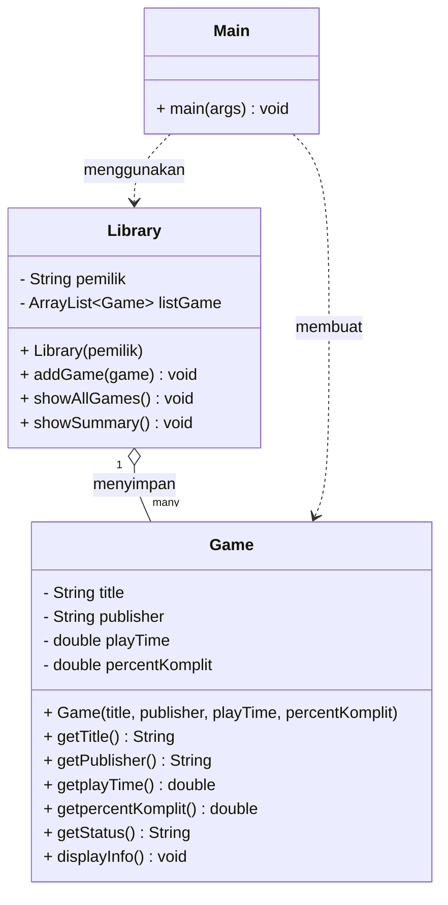

| Field | Keterangan |
|---|---|
| Nama | *Muhamad Nasrulhaq* |
| NRP | *5027251117* |
| Kelas | *B* |
| Mata Kuliah | Struktur Data dan Pemrograman Berorientasi Objek |

# Sistem Penyimpanan Koleksi Game Pribadi

## Deskripsi Kasus

Banyak gamer menyimpan daftar game mereka secara manual, padahal informasi seperti judul, publisher, waktu main, dan persentase kompleasi game bisa dikelola lebih rapi menggunakan program. Proyek ini mensimulasikan sebuah perpustakaan game milik seorang pengguna, di mana setiap game disimpan sebagai objek dengan atribut lengkap. Program juga menampilkan status permainan secara otomatis berdasarkan persentase kompleasi, dan memberikan ringkasan total waktu main serta jumlah game yang sudah selesai.

---

## Class Diagram


```mermaid
classDiagram
    class Game {
        - String title
        - String publisher
        - double playTime
        - double percentKomplit
        + Game(title, publisher, playTime, percentKomplit)
        + getTitle() String
        + getPublisher() String
        + getplayTime() double
        + getpercentKomplit() double
        + getStatus() String
        + displayInfo() void
    }

    class Library {
        - String pemilik
        - ArrayList~Game~ listGame
        + Library(pemilik)
        + addGame(game) void
        + showAllGames() void
        + showSummary() void
    }

    class Main {
        + main(args) void
    }

    Library "1" o-- "many" Game : menyimpan
    Main ..> Library : menggunakan
    Main ..> Game : membuat
```

---

## Kode Program Java

### Game.java

```java
public class Game {
    private String title;
    private String publisher;
    private double playTime;
    private double percentKomplit;

    public Game(String title, String publisher, double playTime, double percentKomplit) {
        this.title = title;
        this.publisher = publisher;
        this.playTime = playTime;
        this.percentKomplit = percentKomplit;
    }

    public String getTitle() {
        return title;
    }

    public String getPublisher() {
        return publisher;
    }

    public double getplayTime() {
        return playTime;
    }

    public double getpercentKomplit() {
        return percentKomplit;
    }

    public String getStatus() {
        if (percentKomplit == 100.0) {
            return "Selesai";
        } else if (percentKomplit >= 50.0) {
            return "Sedang Dimainkan";
        } else {
            return "Baru Dimulai";
        }
    }

    public void displayInfo() {
        System.out.println("Judul       : " + title);
        System.out.println("Publisher   : " + publisher);
        System.out.println("Waktu Main  : " + playTime + " jam");
        System.out.println("Komplisi   : " + percentKomplit + "%");
        System.out.println("Status      : " + getStatus());
    }
}
```

### Library.java

```java
import java.util.ArrayList;

public class Library {
    private String pemilik;
    private ArrayList<Game> listGame;

    public Library(String pemilik) {
        this.pemilik = pemilik;
        this.listGame = new ArrayList<>();
    }

    public void addGame(Game game) {
        listGame.add(game);
    }

    public void showAllGames() {
        System.out.println("==============================");
        System.out.println("  Perpustakaan Game Milik: " + pemilik);
        System.out.println("  Total Game: " + listGame.size());
        System.out.println("==============================");
        for (int i = 0; i < listGame.size(); i++) {
            System.out.println("\n[Game " + (i + 1) + "]");
            listGame.get(i).displayInfo();
            System.out.println("------------------------------");
        }
    }

    public void showSummary() {
        double totalHours = 0;
        int selesai = 0;

        for (Game game : listGame) {
            totalHours += game.getplayTime();
            if (game.getpercentKomplit() == 100.0) {
                selesai++;
            }
        }

        System.out.println("\n====== Ringkasan ======");
        System.out.println("Total waktu main  : " + totalHours + " jam");
        System.out.println("Game selesai      : " + selesai + " dari " + listGame.size());
        System.out.println("=======================");
    }
}
```

### Main.java

```java
public class Main {
    public static void main(String[] args) {

        Library library = new Library("Arul");

        Game game1 = new Game("Hollow Knight", "Team Cherry", 42.5, 100.0);
        Game game2 = new Game("Stardew Valley", "ConcernedApe", 60.0, 30.0);
        Game game3 = new Game("Hades", "Supergiant Games", 25.5, 100.0);

        library.addGame(game1);
        library.addGame(game2);
        library.addGame(game3);

        library.showAllGames();
        library.showSummary();
    }
}
```

---

## Screenshot Output

```
==============================
  Perpustakaan Game Milik: Arul
  Total Game: 5
==============================

[Game 1]
Judul       : Hollow Knight
Publisher   : Team Cherry
Waktu Main  : 42.5 jam
Kompleasi   : 100.0%
Status      : Selesai
------------------------------

[Game 2]
Judul       : Celeste
Publisher   : Maddy Makes Games
Waktu Main  : 18.0 jam
Kompleasi   : 75.0%
Status      : Sedang Dimainkan
------------------------------

[Game 3]
Judul       : Stardew Valley
Publisher   : ConcernedApe
Waktu Main  : 60.0 jam
Kompleasi   : 30.0%
Status      : Baru Dimulai
------------------------------

[Game 4]
Judul       : Hades
Publisher   : Supergiant Games
Waktu Main  : 25.5 jam
Kompleasi   : 100.0%
Status      : Selesai
------------------------------

[Game 5]
Judul       : Undertale
Publisher   : Toby Fox
Waktu Main  : 8.0 jam
Kompleasi   : 15.0%
Status      : Baru Dimulai
------------------------------

====== Ringkasan ======
Total waktu main  : 154.0 jam
Game selesai      : 2 dari 5
=======================
```

---

## Penjelasan Prinsip OOP yang Diterapkan

**1. Encapsulation**
Semua atribut di kelas `Game` (title, publisher, playTimeHours, completionPercent) dideklarasikan sebagai `private`. Akses ke atribut tersebut hanya bisa dilakukan melalui method getter yang bersifat `public`. Hal ini menjaga data agar tidak bisa diubah sembarangan dari luar kelas.

**2. Abstraction**
Logika untuk menentukan status game (Selesai, Sedang Dimainkan, Baru Dimulai) disembunyikan di dalam method `getStatus()`. Pengguna kelas `Game` cukup memanggil method tersebut tanpa perlu tahu detail kondisi if-else di dalamnya.

**3. Object dan Class**
Program menggunakan dua kelas utama yaitu `Game` dan `Library`. Setiap game adalah sebuah objek yang dibuat dari kelas `Game`, dan objek-objek tersebut dikumpulkan ke dalam satu objek `Library`.

**4. Aggregation**
Kelas `Library` memiliki kumpulan objek `Game` di dalam `ArrayList`. Ini adalah hubungan aggregation, di mana `Library` mengandung banyak objek `Game`, namun objek `Game` tetap bisa berdiri sendiri tanpa `Library`.

---

## Keunikan Program

Keunikan program ini dibandingkan teman lain adalah adanya **fitur status otomatis** pada setiap game. Status tidak diinput secara manual, melainkan dihitung secara otomatis oleh method `getStatus()` berdasarkan nilai `percentKomplit`:

- 100% menjadi **Selesai**
- 50% ke atas menjadi **Sedang Dimainkan**
- Di bawah 50% menjadi **Baru Dimulai**

Selain itu, terdapat **fitur ringkasan** di akhir program yang merekap total jam bermain dari semua game dan jumlah game yang sudah selesai, memberikan gambaran keseluruhan koleksi game secara cepat.
